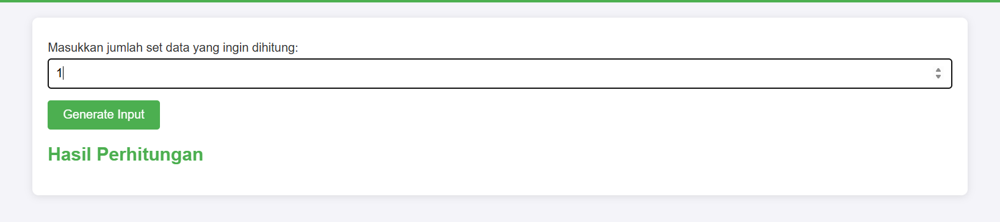
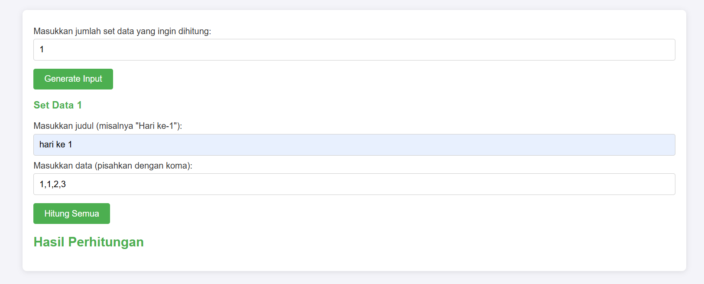
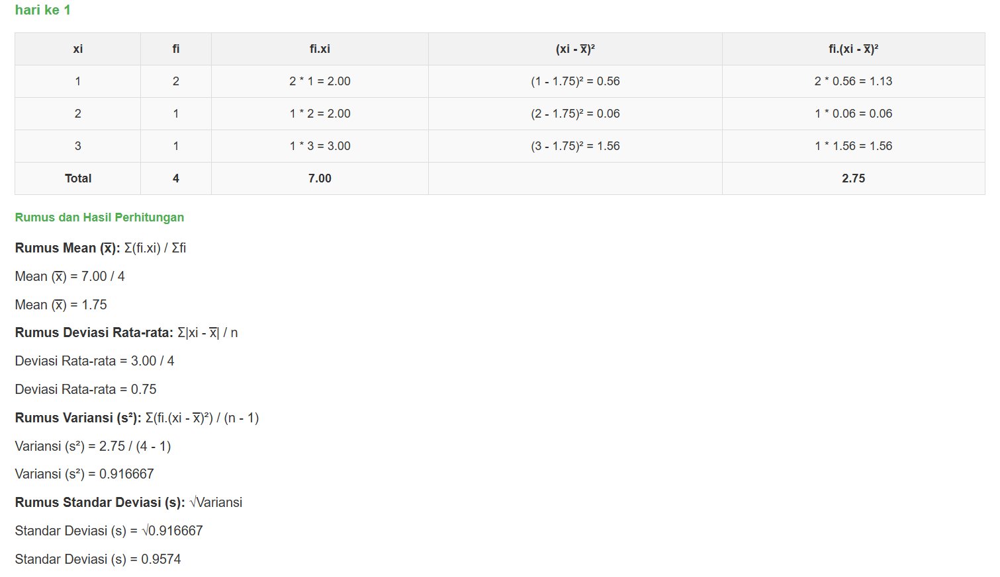

# Proyek Analisis Statistik Dasar

## Deskripsi

Repository ini berisi proyek analisis statistik dasar menggunakan tabel frekuensi data tunggal. Proyek ini mencakup perhitungan **mean (rata-rata)**, **deviasi rata-rata**, **variansi**, dan **standar deviasi** untuk memberikan pemahaman yang lebih mendalam tentang distribusi data.

### Fitur Utama:
- Perhitungan **Mean (Rata-Rata)**
- Perhitungan **Deviasi Rata-Rata**
- Perhitungan **Variansi**
- Perhitungan **Standar Deviasi**
- Analisis data menggunakan **Tabel Frekuensi**

Proyek ini ditujukan untuk membantu mahasiswa, peneliti, atau siapa saja yang ingin memahami dasar-dasar statistik dalam analisis data.

## Cara Penggunaan Program

1. **Masukkan jumlah set data yang akan dihitung**
   - Masukkan jumlah set data yang ingin Anda proses.
   - 

2. **Masukkan judul untuk set data Anda dan Masukkan data Anda (dipisahkan dengan koma)**
   - Masukkan judul atau nama yang menggambarkan set data Anda.
   - Masukkan data yang ingin Anda hitung, dengan memisahkan setiap item data menggunakan koma.
   - 

3. **Klik "Hitung" untuk memproses data**
   - Setelah semua data dimasukkan, klik tombol "Hitung" untuk memproses data Anda.
   - 

## Instalasi

Untuk menjalankan proyek ini secara lokal, Anda dapat mengikuti langkah-langkah berikut:

1. Clone repository ini:
   ```bash
   git clone https://github.com/Hlossen116/analisis-tabel-frekuensi-mean-variasi-standar-deviasi.git
   ```

## Lisensi

Proyek ini dilisensikan di bawah [Lossen Corp](LICENSE).

---
Copyright (c) 2025 Hidayat Lossen
